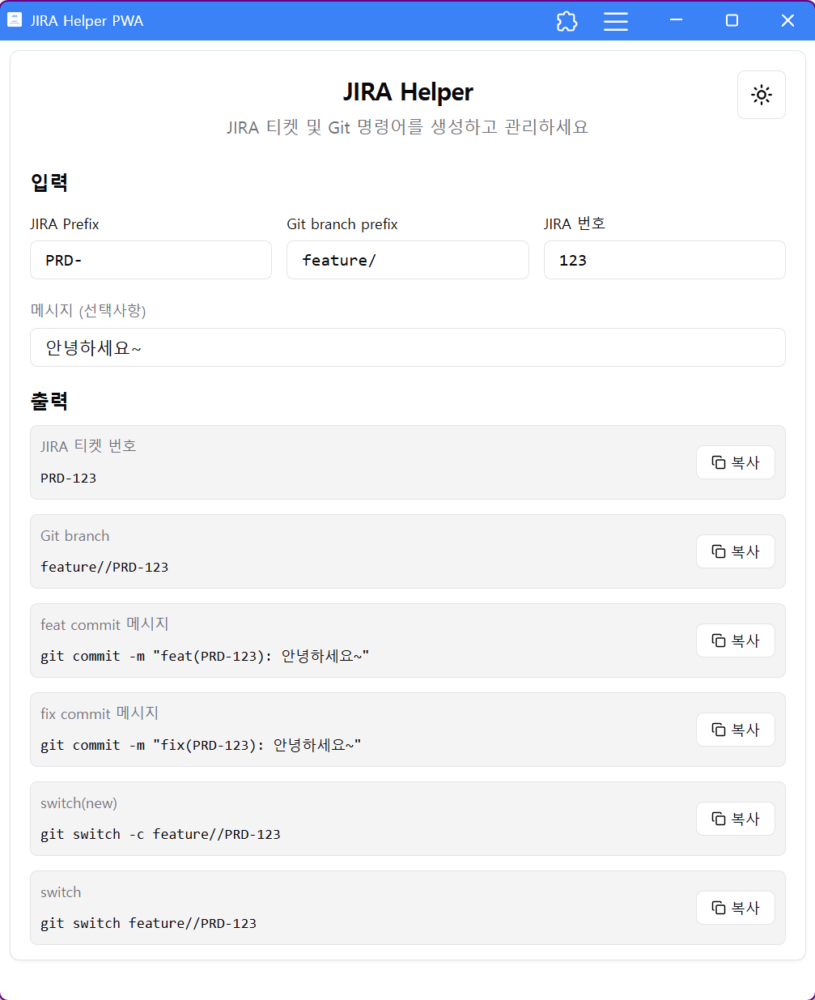

# JIRA Helper PWA 🎯

> **JIRA 티켓 번호 생성 및 Git 커밋 메시지 관리를 위한 Progressive Web App**



## 🚀 개요

JIRA Helper PWA는 개발자들이 JIRA 티켓 번호를 빠르게 생성하고, Git 커밋 메시지와 브랜치 전환 명령어를 자동으로 생성해주는 도구입니다. PWA로 구현되어 모바일과 데스크톱에서 모두 사용할 수 있으며, 오프라인에서도 동작합니다.

## ✨ 주요 기능

### 📝 입력 필드
- **JIRA Prefix**: 프로젝트 접두사 (예: ABC, DEV)
- **Git Branch Prefix**: Git 브랜치 접두사 (예: feature, bugfix)
- **JIRA Number**: 티켓 번호 (숫자만 입력)
- **Message**: 작업 내용 설명 (선택사항)

### 🎯 자동 생성 출력
- **JIRA Ticket**: `PREFIX-NUMBER` 형식의 티켓 번호
- **Feat Commit**: `feat(PREFIX-NUMBER): 메시지` 형식의 커밋 메시지
- **Fix Commit**: `fix(PREFIX-NUMBER): 메시지` 형식의 커밋 메시지
- **Git Switch (New)**: `git switch -c prefix/PREFIX-NUMBER` 새 브랜치 생성 명령
- **Git Switch**: `git switch prefix/PREFIX-NUMBER` 기존 브랜치 전환 명령

### 💡 편의 기능
- 🔄 **원클릭 복사**: 모든 출력 결과를 클립보드에 바로 복사
- 💾 **자동 저장**: 입력한 데이터를 로컬스토리지에 자동 저장
- 🌓 **다크/라이트 테마**: 사용자 환경에 맞는 테마 선택
- 📱 **반응형 디자인**: 모바일 최적화 (작은 화면에서 일부 필드 숨김)
- 🔌 **오프라인 지원**: PWA로 구현되어 인터넷 없이도 사용 가능

## 🛠️ 기술 스택

### Frontend
- **React 19** - 최신 React 기능 활용
- **TypeScript** - 타입 안전성 보장
- **Vite** - 빠른 개발 및 빌드 도구
- **Tailwind CSS** - 유틸리티 기반 스타일링
- **Shadcn UI** - 재사용 가능한 컴포넌트 라이브러리

### State Management & PWA
- **Zustand** - 간단하고 효율적인 상태 관리
- **Vite PWA Plugin** - Progressive Web App 기능
- **Workbox** - 서비스 워커 및 캐싱 전략

### 개발 도구
- **ESLint** - 코드 품질 관리
- **PostCSS** - CSS 후처리

## 🚀 시작하기

### 필수 요구사항
- Node.js 18+ 
- npm 또는 pnpm

### 설치 및 실행

```bash
# 저장소 복제
git clone https://github.com/gyuha/gitlab-jira-helper.git
cd gitlab-jira-helper

# 의존성 설치
npm install
# 또는
pnpm install

# 개발 서버 실행
npm run dev
# 또는
pnpm dev
```

### 빌드

```bash
# 프로덕션 빌드
npm run build
# 또는
pnpm build

# 빌드 결과 미리보기
npm run preview
# 또는
pnpm preview
```

## 📱 PWA 설치

### 데스크톱 (Chrome/Edge)
1. 브라우저 주소창 오른쪽의 설치 아이콘 클릭
2. "앱 설치" 버튼 클릭

### 모바일 (iOS/Android)
1. Safari/Chrome에서 사이트 방문
2. 공유 메뉴 → "홈 화면에 추가" 선택

## 🎯 사용법

### 기본 사용
1. **JIRA Prefix** 입력 (예: `ABC`)
2. **JIRA Number** 입력 (예: `123`)
3. **Message** 입력 (선택사항, 예: `사용자 로그인 기능 구현`)
4. 자동 생성된 결과를 복사 버튼으로 클립보드에 복사

### 출력 예시
```
JIRA Ticket: ABC-123
Feat Commit: feat(ABC-123): 사용자 로그인 기능 구현
Fix Commit: fix(ABC-123): 사용자 로그인 기능 구현
Git Switch (New): git switch -c feature/ABC-123
Git Switch: git switch feature/ABC-123
```

## 🌐 배포

### GitHub Pages
이 프로젝트는 GitHub Pages를 통해 배포됩니다:
- **Live Demo**: [https://gyuha.com/gitlab-jira-helper/](https://gyuha.com/gitlab-jira-helper/)
- 빌드 결과는 `docs` 폴더에 생성됩니다
- 하위 디렉토리 배포를 위한 base path 설정 완료

### 배포 설정
```typescript
// vite.config.ts
export default defineConfig({
  base: '/gitlab-jira-helper/',
  build: {
    outDir: 'docs'
  }
})
```

## 📂 프로젝트 구조

```
gitlab-jira-helper/
├── src/
│   ├── components/         # React 컴포넌트
│   │   ├── JiraHelper.tsx  # 메인 컴포넌트
│   │   ├── ThemeToggle.tsx # 테마 전환 컴포넌트
│   │   └── ui/             # Shadcn UI 컴포넌트
│   ├── stores/             # Zustand 상태 관리
│   │   └── jiraStore.ts    # JIRA 데이터 스토어
│   ├── hooks/              # 커스텀 훅
│   │   └── useTheme.ts     # 테마 관리 훅
│   └── lib/                # 유틸리티 함수
├── public/                 # 정적 파일 (PWA 아이콘 등)
├── docs/                   # 빌드 출력 (GitHub Pages)
└── images/                 # README 이미지
```

## 🎨 커스터마이징

### 테마 설정
- Tailwind CSS 기반의 다크/라이트 테마
- `src/hooks/useTheme.ts`에서 테마 로직 관리
- CSS 변수를 통한 색상 커스터마이징 가능

### PWA 설정
- `vite.config.ts`에서 PWA 옵션 구성
- `public/manifest.json`에서 앱 메타데이터 수정
- 커스텀 아이콘은 `public/` 폴더에 SVG 형식으로 저장

## 🤝 기여하기

1. 이 저장소를 Fork합니다
2. 새로운 기능 브랜치를 생성합니다 (`git checkout -b feature/새기능`)
3. 변경사항을 커밋합니다 (`git commit -m 'feat: 새기능 추가'`)
4. 브랜치에 Push합니다 (`git push origin feature/새기능`)
5. Pull Request를 생성합니다

## 📄 라이선스

MIT License - 자세한 내용은 [LICENSE](LICENSE) 파일을 참조하세요.

## 🛠️ 문제 해결

### 일반적인 문제
- **PWA가 설치되지 않음**: HTTPS 환경에서만 PWA 설치가 가능합니다
- **다크 모드가 작동하지 않음**: 브라우저의 시스템 테마 설정을 확인하세요
- **복사 기능이 작동하지 않음**: 보안상의 이유로 HTTPS 환경에서만 클립보드 API가 작동합니다

### 개발 환경 문제
- **Node.js 버전**: Node.js 18 이상 필요
- **의존성 충돌**: `node_modules` 삭제 후 재설치 시도
- **빌드 오류**: TypeScript 설정과 ESLint 규칙 확인

## 📞 지원

- **Issues**: [GitHub Issues](https://github.com/gyuha/gitlab-jira-helper/issues)
- **Discussions**: [GitHub Discussions](https://github.com/gyuha/gitlab-jira-helper/discussions)

---

**Made with ❤️ by [gyuha](https://github.com/gyuha)**