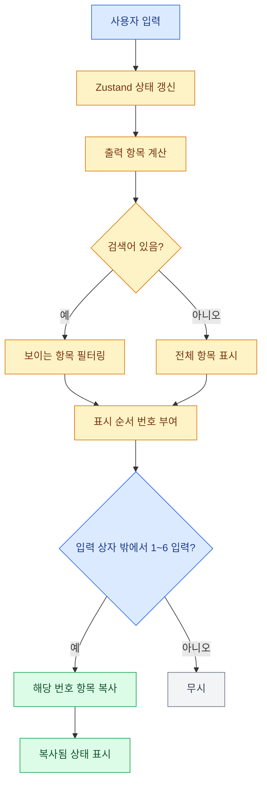

# 숫자키 출력 복사 단축키 설계

## 목표

입력 상자에 포커스가 없을 때 숫자키 `1`부터 `6`까지를 눌러 출력 항목의 값을 클립보드로 복사한다. 사용자는 마우스로 복사 버튼을 누르지 않고도 현재 화면에 표시된 출력 명령을 빠르게 복사할 수 있어야 한다.

## 동작 범위

- 출력 항목 제목 앞에 `1.`, `2.`처럼 현재 표시 순서의 번호를 보여준다.
- 전역 `keydown` 이벤트에서 `1~6` 숫자키를 처리한다.
- `input`, `textarea`, `select`, `contenteditable`에 포커스가 있으면 단축키를 처리하지 않는다.
- `Ctrl`, `Meta`, `Alt`, `Shift` 조합이 있으면 브라우저와 OS 단축키 충돌을 피하기 위해 처리하지 않는다.
- 검색 필터가 적용되어 있으면 화면에 보이는 출력 항목의 번호 기준으로 복사한다.
- 폼이 완성되지 않았거나 해당 번호에 출력 항목이 없으면 아무 동작도 하지 않는다.

## 컴포넌트 설계

`JiraHelper`는 출력 항목 배열을 생성하고 검색어에 따라 `visibleOutputItems`를 계산한다. 키다운 핸들러는 `visibleOutputItems[숫자 - 1]`을 찾아 기존 복사 함수로 전달한다.

`OutputItem`은 `shortcutNumber` prop을 받아 제목 앞에 표시한다. 복사 버튼의 동작은 기존 `onCopy` 콜백을 그대로 사용해 버튼 복사와 단축키 복사가 같은 상태 표시를 공유한다.

## 데이터 흐름

1. 사용자가 입력값을 수정하면 Zustand 상태가 갱신된다.
2. `JiraHelper`가 상태에서 출력 항목 값을 계산한다.
3. 검색어가 있으면 출력 항목이 필터링되고, 화면 표시 순서대로 번호가 붙는다.
4. 사용자가 입력 상자 밖에서 `1~6`을 누르면 해당 표시 번호의 항목 값이 클립보드에 복사된다.
5. 복사 성공 상태는 기존 `copied` 상태로 표시되고 2초 후 초기화된다.

## 오류 및 예외 처리

클립보드 복사는 기존 `navigator.clipboard.writeText()` 경로를 사용한다. 입력 포커스가 있거나 modifier 키 조합이 있거나 표시 항목이 없는 숫자가 눌린 경우에는 별도 오류 없이 무시한다.

## 테스트 계획

- `npm run build`로 TypeScript와 프로덕션 빌드를 확인한다.
- 개발 서버에서 입력값을 채운 뒤 입력 상자 밖을 클릭하고 `1~6` 숫자키로 각 항목 복사를 확인한다.
- 입력 상자에 포커스가 있을 때 숫자 입력이 복사 단축키로 가로채지 않는지 확인한다.
- 검색 필터 적용 시 보이는 항목 번호 기준으로 복사되는지 확인한다.
